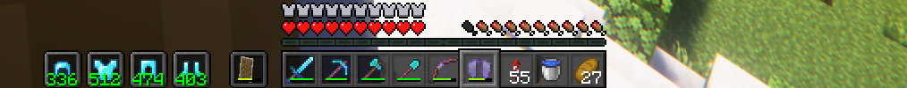
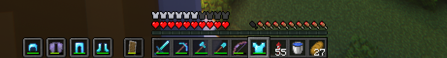
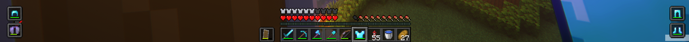

# Armor Hud
- **Changelog: https://github.com/Mcjunky33/ArmorHudMod/blob/main/CHANGELOGver0.3.md**
 
- **Modrinth: https://modrinth.com/mod/armor-hud-by-mcjunky33**
  
- **Curseforge: https://www.curseforge.com/minecraft/mc-mods/armor-hud-by-mcjunky33**
  
## English Description

Armor Hud is a lightweight and fully customizable Minecraft mod that displays your armor and durability directly on the screen. The mod offers a clean and modern interface, allowing you to keep track of your armor status at all times without opening your inventory. All elements of the HUD can be easily adjusted to fit your preferences, making it perfect for both casual and competitive players.

### Features

- **Customizable Positioning:** Move the armor HUD anywhere on your screen using X and Y offsets.
- **Split Mode:** Display armor slots split to left and right sides of your screen for more flexible layouts.
- **Durability Display:** Show armor durability as a bar, a number, or both.
- **Visibility Toggle:** Enable or disable the HUD as needed.
- **Dark Mode:** Switch between light and dark backgrounds for better visibility.
- **Vertical/Horizontal Layout:** Display your armor items either side by side or stacked vertically.
- **Box Size & Spacing:** Freely adjust the size of the armor boxes and the spacing between them in the config menu.
- **Live Preview:** Instantly see changes in a preview of the HUD while configuring.
- **Keybind Access:** Open the configuration menu instantly via a keybind (default: F10).
- **Localization:** The mod automatically adapts to your Minecraft language (supports English and German).
- **Simple Configuration:** All options are accessible via a user-friendly, modern ModMenu interface.
- **Crash Fixes:** Various random crashes have been fixed, improving stability.

### Why use Armor Hud?

Armor Hud gives you a competitive advantage by letting you monitor your armor’s condition at a glance. This can help you react quickly in combat, avoid breaking your valuable armor, and manage your equipment more efficiently. The mod is lightweight, does not affect performance, and is compatible with most other mods.

### How to Use

1. Install Fabric and ModMenu.
2. Download and place the Armor Hud mod into your `mods` folder.
3. Start Minecraft and open the configuration screen via ModMenu or by pressing F10 to adjust the HUD to your liking.

---

## Deutsche Beschreibung

Armor Hud ist eine schlanke und vollständig anpassbare Minecraft-Mod, die deine Rüstung und deren Haltbarkeit direkt auf dem Bildschirm anzeigt. Das moderne und übersichtliche Interface ermöglicht es dir, deinen Rüstungsstatus jederzeit im Blick zu behalten, ohne das Inventar öffnen zu müssen. Alle Elemente des HUDs können flexibel an deine Wünsche angepasst werden – ideal für Casual- und PvP-Spieler.

### Funktionen

- **Frei positionierbar:** Verschiebe das Armor HUD beliebig auf deinem Bildschirm mit X- und Y-Offsets.
- **Split-Modus:** Zeigt die Rüstungsslots geteilt auf der linken und rechten Seite des Bildschirms für mehr Flexibilität.
- **Haltbarkeitsanzeige:** Zeige die Haltbarkeit deiner Rüstung als Balken, als Zahl oder beides an.
- **Sichtbarkeit umschaltbar:** Schalte das HUD je nach Bedarf ein oder aus.
- **Darkmode:** Wechsel zwischen hellem und dunklem Hintergrund für optimale Lesbarkeit.
- **Vertikale/Horizontale Anordnung:** Stelle die Rüstungsteile nebeneinander oder untereinander dar.
- **Kästchengröße & Abstand:** Passe die Größe der Rüstungskästchen und die Abstände im Menü frei an.
- **Live-Vorschau:** Sieh Änderungen sofort in einer Vorschau des HUDs beim Konfigurieren.
- **Tastenkürzel:** Öffne das Konfigurationsmenü direkt per Tastenkürzel (Standard: F10).
- **Sprachunterstützung:** Die Mod passt sich automatisch deiner Minecraft-Sprache an (Englisch und Deutsch werden unterstützt).
- **Einfache Konfiguration:** Alle Einstellungen sind bequem über das moderne ModMenu erreichbar.
- **Fehlerbehebungen:** Diverse zufällige Java-Crashes wurden behoben und die Stabilität erhöht.

### Warum Armor Hud?

Armor Hud verschafft dir einen Vorteil, da du den Zustand deiner Rüstung immer direkt im Blick hast. So kannst du schnell reagieren, bevor deine Rüstung zerbricht, und dein Equipment effizienter verwalten. Die Mod ist ressourcenschonend, beeinträchtigt die Performance nicht und ist mit den meisten anderen Mods kompatibel.

### Anwendung

1. Installiere Fabric und ModMenu.
2. Lade Armor Hud herunter und lege die Datei in deinen `mods`-Ordner.
3. Starte Minecraft und öffne das Konfigurationsmenü über ModMenu oder per F10, um das HUD nach deinen Vorstellungen einzustellen.

